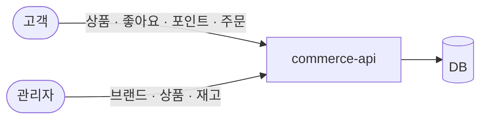

# 버드뷰

누가 무엇을 요청하고 어느 시스템이 처리하는지만 그린다.
한 요청의 단계·분기·실패는 `usecase.md` 에 있다.

```mermaid
flowchart LR
    고객([고객]) -->|"상품 · 좋아요 · 포인트 · 주문"| API[commerce-api]
    관리자([관리자]) -->|"브랜드 · 상품 · 재고"| API
    API --> DB[(DB)]
```

고객과 관리자가 같은 상품을 다뤄도 입력·권한·응답은 다르다. 고객의 가격 조회와
관리자의 가격 변경은 서로 다른 계약이다.
