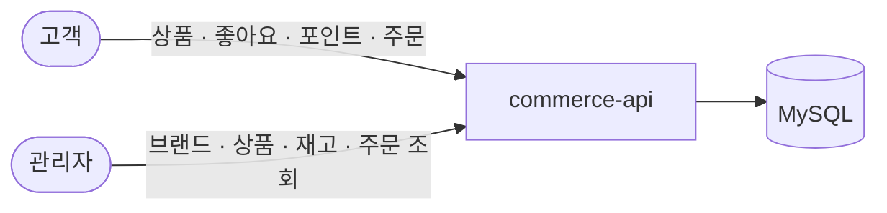

# 설계 문서 — 2주차

## 개요

브랜드·상품·좋아요·포인트·주문을 다루는 커머스 API 다. 고객은 상품을 보고 좋아요를 누르고
포인트를 충전해 주문하며, 관리자는 브랜드·상품을 관리하고 재고와 주문을 본다.

---

## API 목록

요청자는 `X-USER-ID` 헤더로 식별한다. 관리자 API 는 `X-USER-ROLE: ADMIN` 을 함께 요구하며,
역할이 다르면 `403`, 헤더 자체가 없으면 `400` 이다.

### 고객 — `/api/v1`

| 메서드 · 경로 | 하는 일 | 대표 거절 |
| --- | --- | --- |
| `GET /brands/{brandId}` | 브랜드 상세 | 없거나 삭제됨 `404` |
| `GET /products` | 상품 목록. 브랜드 필터 · 페이징 · 정렬 | 잘못된 정렬 값 `400` |
| `GET /products/{productId}` | 상품 상세. 브랜드명 · 좋아요 수 포함 | 없거나 삭제됨 `404` |
| `POST /products/{productId}/likes` | 좋아요 등록. 멱등 | 없거나 삭제된 상품 `404` |
| `DELETE /products/{productId}/likes` | 좋아요 해제. 멱등 | 없음 |
| `GET /users/{userId}/likes` | 내 좋아요 목록. 삭제된 상품 제외 | 남의 목록 `403` |
| `POST /points/charge` | 포인트 충전. 충전 후 잔액 반환 | 충전액 0 이하 `400` |
| `GET /points` | 잔액 조회. 충전한 적 없으면 0원 | 없음 |
| `POST /orders` | 주문 생성. `DRAFT` 저장 · 재고 차감 | 수량 0 · 중복 품목 `400`, 재고 부족 `400`, 없는 상품 `404` |
| `POST /orders/{orderId}/confirm` | 주문 확정. 포인트 차감 · 금액 고정 | 잔액 부족 `400`, 재확정 `409`, 남의 주문 `404` |
| `DELETE /orders/{orderId}` | 주문 취소. 재고 복원, 확정분은 포인트도 복원 | 이미 취소 `409`, 남의 주문 `404` |
| `GET /orders` | 내 주문 목록 | 없음 |
| `GET /orders/{orderId}` | 내 주문 상세. 품목 · 수량 · 단가 포함 | 남의 주문 `404` |

### 관리자 — `/api-admin/v1`

| 메서드 · 경로 | 하는 일 | 대표 거절 |
| --- | --- | --- |
| `GET /brands` | 브랜드 목록. 삭제된 것 제외 | 없음 |
| `POST /brands` | 브랜드 생성 | 이름 규칙 위반 `400` |
| `GET /brands/{brandId}` | 브랜드 상세 | 없거나 삭제됨 `404` |
| `PUT /brands/{brandId}` | 브랜드 수정 | 이름 규칙 위반 `400` |
| `DELETE /brands/{brandId}` | 브랜드 삭제 | 삭제되지 않은 상품이 남음 `409` |
| `GET /products` | 상품 목록. 삭제된 것 제외 | 없음 |
| `POST /products` | 상품 생성. 재고는 0으로 시작 | 이름·가격 규칙 위반 `400`, 없는 브랜드 `404` |
| `GET /products/{productId}` | 상품 상세 | 없거나 삭제됨 `404` |
| `PUT /products/{productId}` | 상품 수정. 브랜드는 유지 | 이름·가격 규칙 위반 `400` |
| `PUT /products/{productId}/stock` | 재고 변경. **증가 값**을 더한다 | 음수 `400` |
| `DELETE /products/{productId}` | 상품 삭제. 좋아요도 함께 삭제 | 재고가 남음 `409` |
| `GET /orders` | 전체 주문 목록. 구매자를 가리지 않음 | 없음 |
| `GET /orders/{orderId}` | 주문 상세. 소유자를 가리지 않음 | 없는 주문 `404` |

**목록은 대상이 없어도 `200` 과 빈 List 다.** 없는 것은 오류가 아니다.

---

## 1. 버드뷰

누가 무엇을 요청하고 어느 시스템이 처리하는지만 본다.



고객과 관리자가 같은 상품을 다뤄도 입력·권한·응답이 다르다. 그래서 경로를 `/api/v1/**` 과
`/api-admin/v1/**` 으로 나눴다. 같은 자원이라도 **서로 다른 계약**이기 때문이다.

---

## 2. 도메인 모델

### 개념과 관계

```
Brand 1 ── N Product
User  1 ── N Like N ── 1 Product
User  1 ── N Order 1 ── N OrderItem
User  1 ── 1 PointBalance
```

### 관계를 객체 참조로 만들지 않은 곳

`Product` 는 `Brand` 객체가 아니라 `brandId: Long` 만 들고 있다. 상품이 브랜드의 상태나
행동을 쓸 일이 없고, 조회 결과에 브랜드명을 붙이는 일은 application 이 맡기 때문이다.

같은 이유로 `Like` 와 `Order` 도 `userId` · `productId` 만 보관한다.

### 좋아요를 수치가 아니라 관계로 저장한 이유

`Product.likeCount` 만 두면 몇 명이 눌렀는지는 알아도 **누가** 눌렀는지를 모른다. 그러면

- 같은 사람이 두 번 눌러도 막을 수 없고
- 자기 좋아요만 취소할 수 없고
- 내 좋아요 목록을 만들 수 없다

관계로 저장하면 셋이 한꺼번에 풀린다. 좋아요 수는 `count` 로 세고, 카운터를 따로 두지 않아
**관계와 카운터를 일치시키는 책임**이 아예 생기지 않는다.

### 주문이 금액을 저장하는 이유

주문서를 저장하지 않으면 조회할 때마다 상품 가격으로 다시 계산하게 된다. 그러면 나중에
가격이 바뀔 때 **과거 주문 금액도 같이 바뀐다.**

그래서 `Order` 는 품목별 단가·수량·합계를, 확정 시에는 결제액을 저장한다. 확정 후 조회는
다시 계산하지 않고 저장된 값을 읽는다.

---

## 3. 책임 배치

| 역할 | 무엇을 맡나 | 예 |
| --- | --- | --- |
| **Value Object** | 값 자체의 유효성 | `Money` 는 음수를 거절하고, `Stock` 은 음수와 보유량 초과를 거절한다 |
| **Entity** | 자기 상태와 그 상태를 지키는 규칙 | `Order.confirm` 은 상태 전이와 금액 일치를 확인한다 |
| **Domain Service** | 여러 모델을 함께 봐야 하는 판단 | `BrandService.delete` 는 상품 수를 세고 거절한다 |
| **Application(Facade)** | 조회·행동 호출·저장의 순서 조율, 조회 결과 조합 | `ProductFacade` 가 상품·브랜드·좋아요 수를 묶는다 |
| **Controller** | 입력 파싱, 응답 DTO, 요청자 식별 | `X-USER-ID` · `X-USER-ROLE` 을 읽는다 |

---

## 4. 계층과 의존 방향

```
interfaces  →  application  →  domain  ←  infrastructure
```

모든 화살표가 `domain` 으로 들어온다. `domain` 은 어디에도 의존하지 않아 Spring·DB 없이
테스트할 수 있다. 실제로 `Money` · `Stock` · `Product` · `Order` 의 규칙은 전부 단위 테스트다.

---

## 5. 주요 설계 판단

| # | 판단 | 이유 | 다시 볼 조건 |
| --- | --- | --- | --- |
| 1 | 재고는 **주문 생성 시** 차감한다 | 확정 전 취소에서 되돌릴 재고가 있어야 한다 (유스케이스 2) | 미확정 주문이 재고를 오래 잡는 문제가 생기면 |
| 2 | 확정은 **결제와 금액 고정**만 한다 | 재고는 이미 잡혀 있다 | PG 도입 시 확정이 두 사건으로 쪼개진다 |
| 3 | 보상 트랜잭션을 만들지 않았다 | 재고·포인트·주문이 한 DB 라 롤백이 되돌린다 | PG 도입 시 환불 대기·재시도·멱등키가 필요해진다 |
| 4 | 브랜드·상품 모두 **soft delete** | 삭제된 것을 없는 것으로 취급하면 참조가 깨지지 않는다 | — |
| 5 | 브랜드 삭제는 **상품의 존재**를 본다 | 재고가 0인 상품도 남아 있는 상품이다 | — |
| 6 | 상품 삭제 시 좋아요는 **실제로 지운다** | 관계는 되살릴 대상이 아니다 | — |
| 7 | 좋아요 등록·해제는 **멱등**이다 | 같은 요청을 여러 번 보내도 결과가 같아야 한다 | — |
| 8 | 남의 주문은 **없는 주문과 같은 404** | 주문의 존재가 새어나가면 안 된다 (W1 INV-001) | — |
| 9 | 남의 좋아요 목록은 **403** | 요청자가 자기 id 를 이미 알아 숨길 것이 없다 | — |
| 10 | 정렬 동률은 **`id` 내림차순**으로 가른다 | 보조 기준이 없으면 페이지마다 순서가 달라져 같은 상품이 두 번 나오거나 빠진다 | — |

### 되돌리기 비용으로 순서를 정했다

여러 단계가 실패할 수 있을 때, **되돌리기 싼 것을 먼저 하고 비싼 것을 마지막에** 둔다.

```
재고 차감  →  포인트 차감  →  주문 확정
   싸다        싸다          되돌릴 일 없음
```

지금은 셋 다 같은 DB 라 순서를 바꿔도 결과가 같다. 하지만 외부 결제가 들어오면 결제만
되돌리기 비싸지므로, 이 순서만 보상 코드 없이 버틴다.

### 비어 있는 결과는 오류가 아니다

목록 조회는 대상이 없어도 `200` 과 빈 List 를 준다. 좋아요를 이미 눌렀는데 또 눌러도
성공이다. **요청한 상태가 이미 이뤄져 있으면 성공**이라는 기준을 목록과 멱등 양쪽에 같이 썼다.

---

## 6. 유스케이스

22개 흐름이 `usecase.md` 에 있다.

| 범위 | 유스케이스 |
| --- | --- |
| 주문 | 1 주문 · 2 확정 전 취소 · 3 확정 후 취소 · 18~20 주문 조회 |
| 좋아요 | 4 등록 · 5 해제 · 22 내 목록 |
| 포인트 | 8 충전 |
| 브랜드 | 6 삭제 · 9 생성 · 10 상세 · 11 목록 · 12 수정 |
| 상품 | 7 삭제 · 13 생성 · 14 상세 · 15 목록 · 16 수정 · 17 재고 변경 · 21 고객 목록 |

흐름도가 기준이다. 코드와 어긋나면 코드를 고쳤고, 흐름도 자체가 나중에 정한 것과 맞지 않게
되면 그때만 흐름도를 고치고 이유를 남겼다.

---

## 7. 검증

| 무엇을 확인하나 | 어디서 |
| --- | --- |
| 값과 상태의 규칙 | 도메인 단위 테스트. Spring·DB 없음 |
| 여러 모델의 협력과 저장 | 통합 테스트. 실제 DB(Testcontainers) |
| 입력·응답·오류의 HTTP 모양 | E2E 테스트 |
| 계층 의존 방향 | `ArchitectureTest` (ArchUnit) |
| 스타일 | ktlint |

TDD 로 진행했다. 기대 동작을 테스트로 먼저 쓰고, **의도한 이유로 실패하는 것을 실행해서
확인한 뒤** 통과시키는 최소 구현을 했다. 거절 사례만 검증하면 모든 요청을 거절하는 구현도
통과하므로 정상 사례를 항상 함께 두었다.

한 번은 통합 테스트가 무더기로 실패했는데 Docker 가 꺼져 DB 를 못 띄운 것이었다.
실행되지 않은 실패는 RED 가 아니므로 다시 실행해 실제 RED 를 확인하고 진행했다.

---

## 8. 범위 밖

| 항목 | 이유 | 들어오면 바뀌는 것 |
| --- | --- | --- |
| 쿠폰 | 이번 주 명세에 API 가 없다 | 유스케이스 1의 적용·소진, 3의 복원이 채워진다 |
| 외부 결제(PG) | 한 트랜잭션 가정이 성립한다 | 확정이 두 사건으로 쪼개지고 보상·멱등키가 필요해진다 |
| 배송·출고 | 취소를 확정 전·후 두 경우로만 다룬다 | 반송·반품으로 분화하고 주문 상태가 다축이 된다 |
| 사용자 도메인 | `X-USER-ID` 를 그대로 신뢰한다 | 존재 확인과 인증이 들어간다 |
| 고객 브랜드 목록 | 명세에 없다 | 상품 목록의 브랜드 필터를 실제로 쓰려면 필요해진다 |

이 항목들은 **몰라서 안 한 것이 아니라 알고 안 한 것**이다. 각 행의 오른쪽이 다시 볼 조건이다.

---

## 참고 문서

| 문서 | 무엇이 있나 |
| --- | --- |
| [`birdview.md`](birdview.md) | 버드뷰. 액터 · 서버 · 저장소만 그린 한 장 |
| [`usecase.md`](usecase.md) | 유스케이스 22개의 흐름도. 단계 · 분기 · 실패 경로 |
| [`decisions.md`](decisions.md) | 도메인 결정의 목록. 주문 · 취소 · 좋아요 · 브랜드 · 상품 · 목록 조회 · 조회 권한 · 삭제 · 범위 밖 |
| [`progress.md`](progress.md) | 구현 순서와 TDD 기록. RED 를 확인하지 못한 건까지 남겼다 |
