# 유스케이스 흐름

각 흐름은 유스케이스 하나를 다룬다. 빨간 노드는 실패, `거절` 로 끝나면 되돌릴 것이 없고
`재고 복원` 을 거치면 되돌릴 것이 있다.

---

## 1. 주문

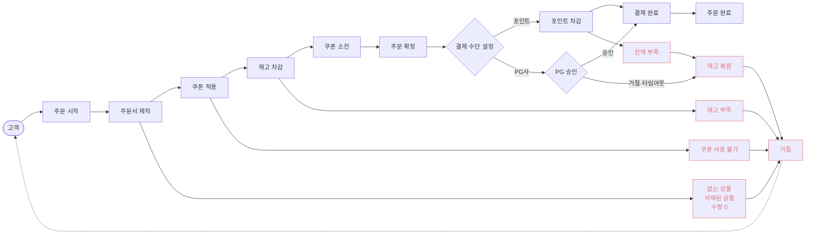

쿠폰 적용과 쿠폰 소진은 선택 단계다. 쿠폰을 쓰지 않으면 둘 다 건너뛴다.

---

## 2. 주문 취소 — 확정 전

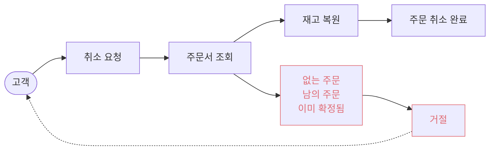

---

## 3. 주문 취소 — 확정 후

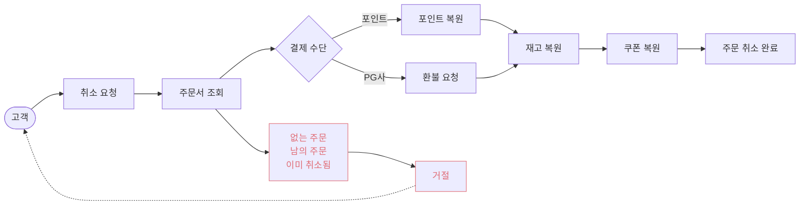

복원은 차감의 역순이다. 환불 실패 처리는 PG 도입 시 정한다.

---

## 4. 좋아요 등록

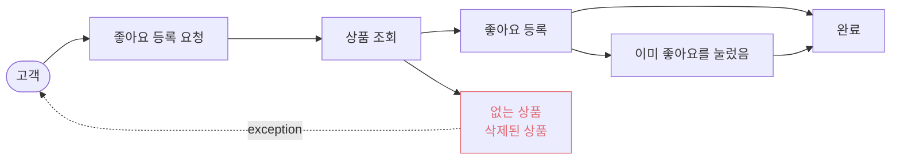

---

## 5. 좋아요 해제

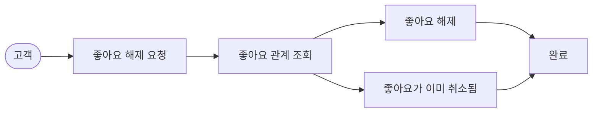

이미 그 상태여도 완료로 끝난다. 같은 요청을 여러 번 보내도 결과가 같다.

등록과 달리 상품의 존재·삭제 여부를 보지 않는다. 삭제된 상품에 남아 있는 자신의 관계도
취소할 수 있어야 하기 때문이다. 그래서 이 흐름에는 거절 경로가 없다.

---

## 6. 브랜드 삭제

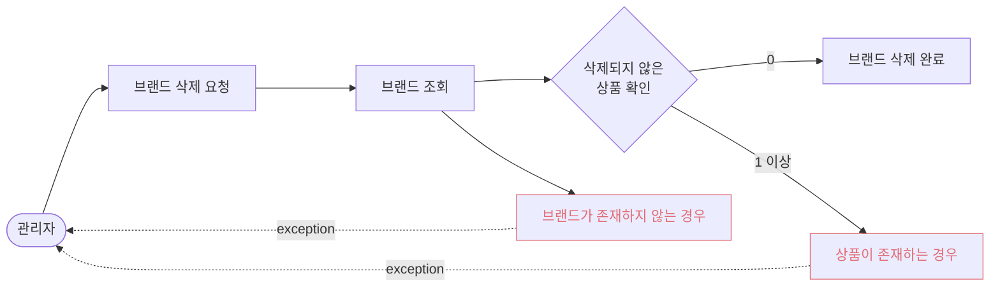

---

## 7. 상품 삭제

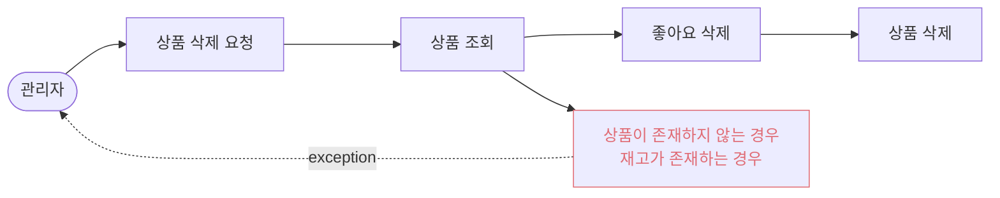

---

## 8. 포인트 충전

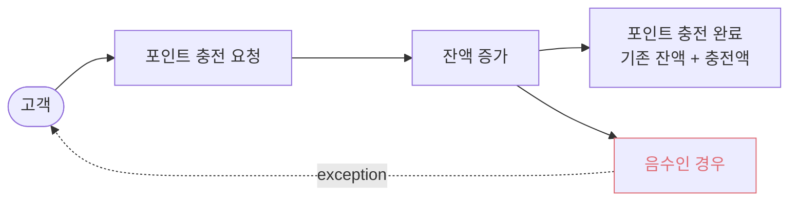


---

## 9. 브랜드 생성

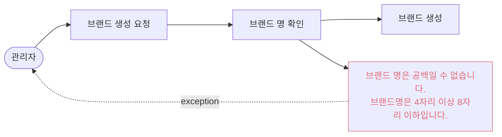

---

## 10. 브랜드 상세 조회

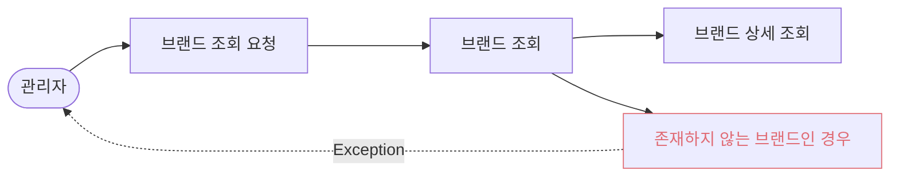

---

## 11. 브랜드 목록 조회

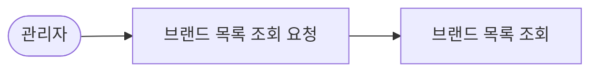

아무 브랜드도 없는 경우 빈 List 를 반환한다. 거절 경로가 없다.

---

## 12. 브랜드 수정

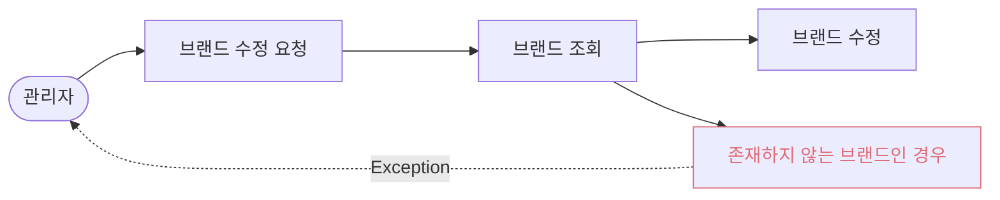

---

## 13. 상품 생성

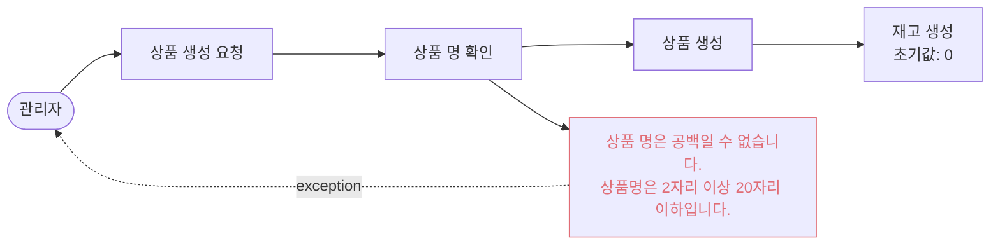

재고는 생성에서 받지 않는다. 항상 0으로 시작하고 재고 변경으로만 바꾼다.

---

## 14. 상품 상세 조회

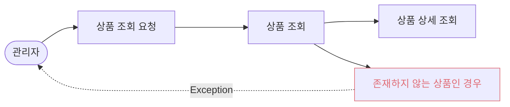

상세에서 좋아요 수와 재고를 확인할 수 있다.

---

## 15. 상품 목록 조회

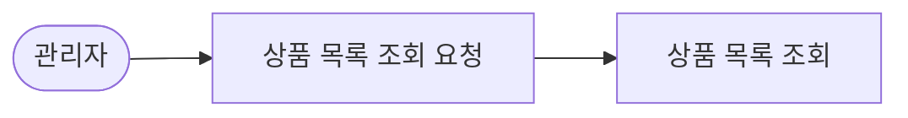

좋아요 갯수를 확인할 수 있다. 아무 상품도 없는 경우 빈 List 를 반환한다.

---

## 16. 상품 수정

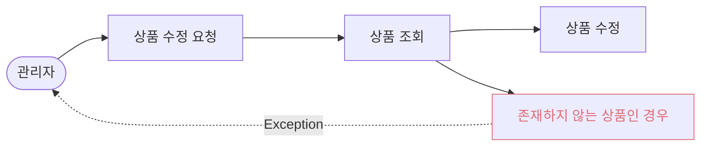

---

## 17. 상품 재고 변경

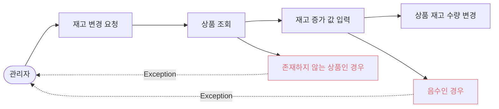

최종 수량을 설정하는 것이 아니라 **증가 값**을 받는다. 음수만 거절하므로 0 은 통과하고
재고가 바뀌지 않는다.

---

## 18. 주문 목록 조회 — 관리자

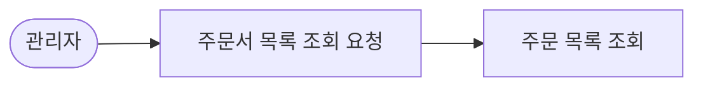

아무것도 없는 경우 빈 리스트를 리턴한다.

---

## 19. 주문 상세 조회 — 관리자

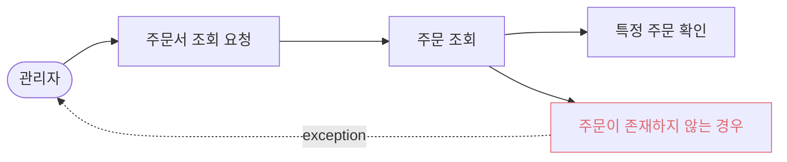

관리자는 소유자를 가리지 않고 조회한다.

---

## 20. 주문 상세 조회 — 고객

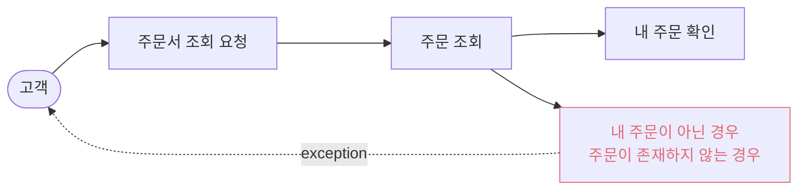

하위에 주문 line 이 있다. 주문 line 은 `상품 × 수량` 이다.

**내 주문이 아닌 경우와 존재하지 않는 경우가 같은 박스다.** 두 응답이 구별되지 않아야
남의 주문이 있다는 사실이 새어나가지 않는다.

---

## 21. 상품 목록 조회 — 고객

```mermaid
flowchart LR
    고객([고객]) --> A[상품 목록 조회 요청]
    A --> B["필터링<br/>- 브랜드 필터<br/>- 페이지 조회<br/>latest · price_asc · likes_desc 정렬"]
    B --> C["상품 목록 조회<br/>+ 재고 수량<br/>+ 좋아요 갯수"]
```

필터링에 걸리지 않는 경우 빈 리스트를 반환한다.

---

## 22. 좋아요 목록 조회 — 고객

```mermaid
flowchart LR
    고객([고객]) --> A[좋아요 목록 조회 요청]
    A --> B[상품 + 좋아요 확인]
    B --> C["내가 좋아요를 누른<br/>상품 리스트 확인"]

    B --> B1[내 좋아요가 아닌 경우]
    B1 -.->|exception| 고객

    classDef fail stroke:#e06c75,color:#e06c75
    class B1 fail
```

좋아요가 하나도 없는 경우 빈 리스트를 반환한다.

삭제된 상품은 **거절하지 않고 목록에서 제외한다.** 거절하면 좋아요해 둔 상품이 삭제된 순간
그 사용자는 목록을 볼 수 없게 되고, 목록을 못 보니 그 좋아요를 취소할 수도 없다.
