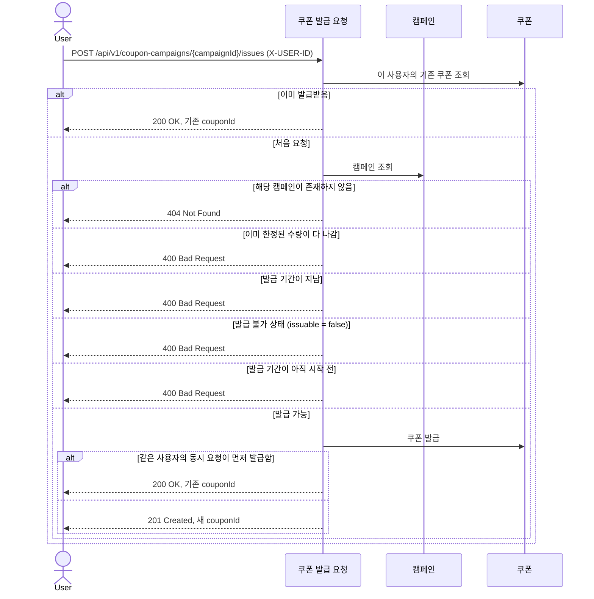

# 쿠폰 발급

```mermaid
sequenceDiagram
    actor User
    participant API as 쿠폰 발급 요청
    participant Campaign as 캠페인
    participant Coupon as 쿠폰

    User->>API: POST /api/v1/coupon-campaigns/{campaignId}/issues (X-USER-ID)
    API->>Coupon: 이 사용자의 기존 쿠폰 조회

    alt 이미 발급받음
        API-->>User: 200 OK, 기존 couponId
    else 처음 요청
        API->>Campaign: 캠페인 조회
        alt 해당 캠페인이 존재하지 않음
            API-->>User: 404 Not Found
        else 이미 한정된 수량이 다 나감
            API-->>User: 400 Bad Request
        else 발급 기간이 지남
            API-->>User: 400 Bad Request
        else 발급 불가 상태 (issuable = false)
            API-->>User: 400 Bad Request
        else 발급 기간이 아직 시작 전
            API-->>User: 400 Bad Request
        else 발급 가능
            API->>Coupon: 쿠폰 발급
            alt 같은 사용자의 동시 요청이 먼저 발급함
                API-->>User: 200 OK, 기존 couponId
            else
                API-->>User: 201 Created, 새 couponId
            end
        end
    end
```
