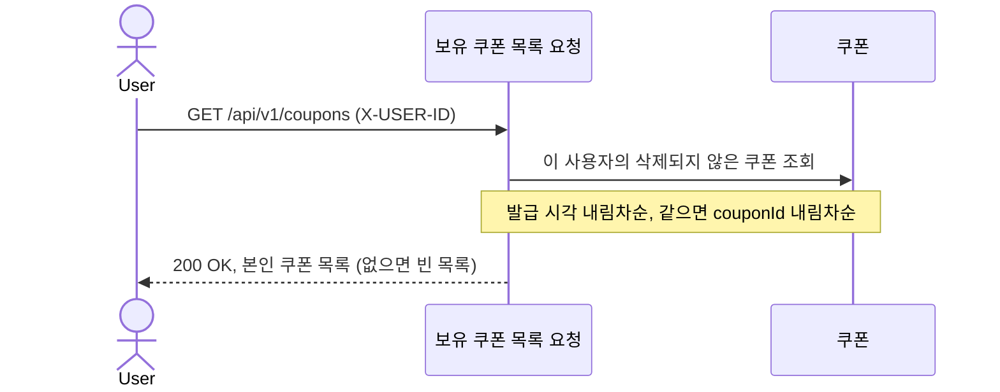

# 보유 쿠폰 목록

```mermaid
sequenceDiagram
    actor User
    participant API as 보유 쿠폰 목록 요청
    participant Coupon as 쿠폰

    User->>API: GET /api/v1/coupons (X-USER-ID)
    API->>Coupon: 이 사용자의 삭제되지 않은 쿠폰 조회
    Note over API,Coupon: 발급 시각 내림차순, 같으면 couponId 내림차순
    API-->>User: 200 OK, 본인 쿠폰 목록 (없으면 빈 목록)
```
